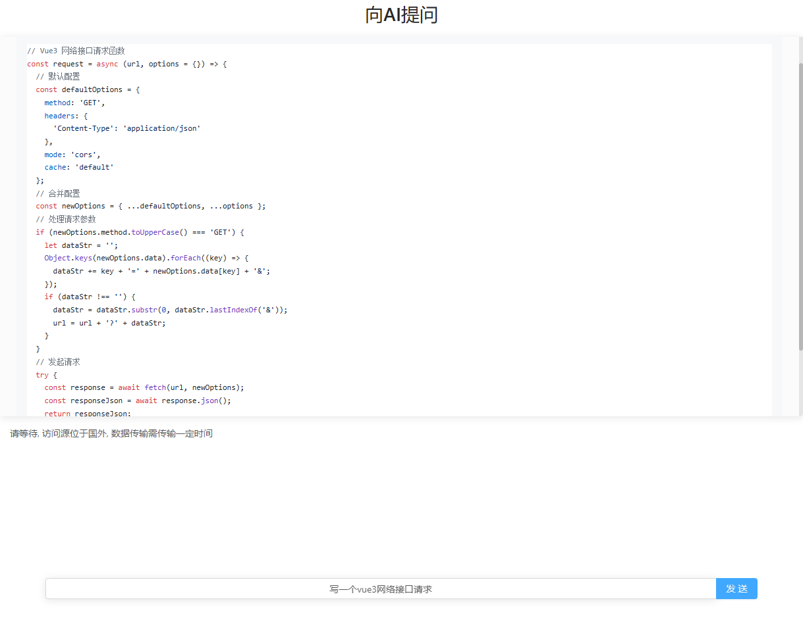

# clover-chat-GPT




## Quick Start

1. 注册一个openai帐号,获取token(token获取页: https://beta.openai.com/account/api-keys)
2. 将你的token替换到`composables/openai.ts`的第6行
   ```js
   const configuration = new Configuration({
      organization: "org-mvGmOG9Wjd3szwU5aeeUt9NO",
      apiKey: "your token",
    });
   ```

## Build Setup

```bash
# install dependencies
$ yarn install

# serve with hot reload at localhost:3000
$ yarn dev

# build for production and launch server
$ yarn build
$ yarn start

# generate static project
$ yarn generate
```
## 如何部署
以centOS7.x为例（注意：你的服务器所在地区必须能够访问openai！）
1. 服务器安装git和nginx `yum install git nginx -y && nginx`
2. 服务器安装node 
   1. `curl -sL https://rpm.nodesource.com/setup_16.x | bash -` (至少14版本但最好17以下)
   2. `yum install -y nodejs`
3. 服务器安装yarn `npm install --global yarn`
4. 服务器安装pm2 `npm install pm2 -g`
5. 在你喜欢的目录下克隆本项目 `git clone https://github.com/wzc520pyfm/clover-chat-GPT.git`
6. 进入项目目录 `cd clover-chat-GPT`, 更换你的OpenAI_Key(参照QuickStart)
7. 安装依赖 `yarn`
8. 项目打包 `yarn build`
9. 启动项目 `pm2 start`
10. 项目启动在3000端口, 确保3000端口未被占用, 且服务器安全组放通3000端口
11. 通过服务器ip:3000即可访问, 若无法访问则使用nginx转发3000端口
12. 最后可使用nginx配置域名转发
    1.  ```nginx
          server {
            listen 5577;
            server_name openai;
            location / {
              proxy_pass http://localhost:3000;
            }
          }
        ```
    2. 服务器放通5577端口
    3. 使用ip:5577访问项目
